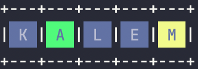

# Wordle AI TR

# _**Tutorial**_

#### Ekrana çıkan kelimenin içindeki harflerin renklerine göre giriş yapılır.

#### Yeşil(Green) için 'G' harfi

#### Sarı(Yellow) için 'Y' harfi

#### Siyah(Black) için 'B' harfi kullanınız.

**Örnek:**

K harfi siyah yandığı için _**'B'**_ harfini kullanıyoruz.

 A harfi yeşil yandığı için _**'G'**_ harfini kullanıyoruz.

 M harfi sarı yandığı için **_'Y'_** harfini kullanıyoruz

Yani Kısaca girmemiz gereken girdi `'BGBBY'` olacaktır.

Böylelikle program bize buna uygun yeni kelime üretecektir.

### Created by _**EmreYlr**_
